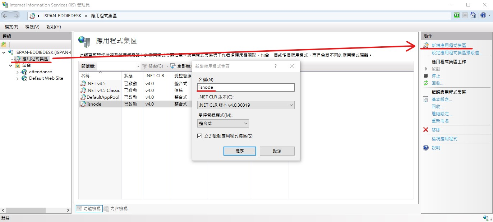
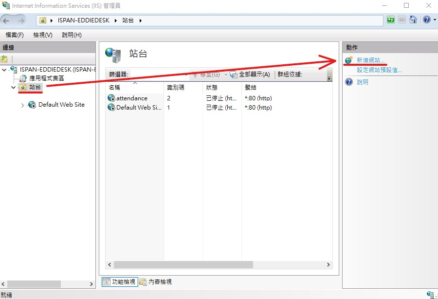
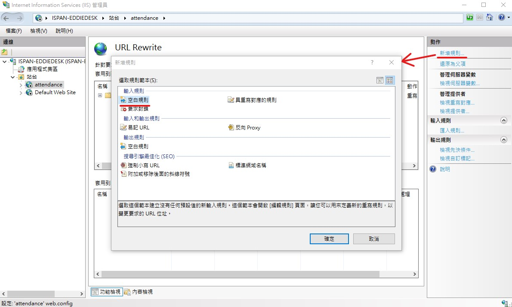
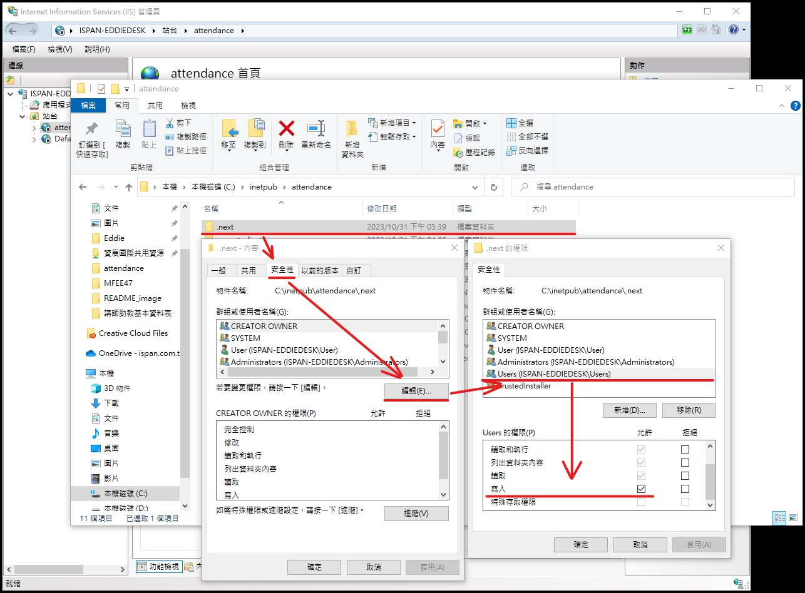

## 前端工程師負責部分

### 專案打包指令

1. 在終端機中輸入「 npm run build 」，會在資料夾中產出「 .next/ 」資料夾。

2. 將「 .next/ 」、「 node_modules/ 」、「 public/ 」、「 .env 」、「 next.config.js 」、「 package.json 」、「 package-lock.json 」放入伺服器中的專案資料夾。

> 備註：
>  
> 上圖的藍色方框 「 node_modules/ 」和 「 package.json && package-lock.json 」+ npm install 兩種方式可以二擇一。

## 後端工程師負責部分

### 安裝 IIS 步驟

1.  確認電腦為 windows 專業版

2.  安裝IIS 
 控制台 >> 程式集 >> 程式和功能 >> 開啟或關閉 windows 功能

 把以下圖片 IIS 相關功能打開 

>備註：請注意【要求篩選】、【.NET Extensibility 4.8】、【ASP.NET4.8】要另外打開

3. 安裝 [IISnode](https://github.com/Azure/iisnode/wiki/iisnode-releases)  
請選擇【iisnode for iis 7/8 (x64)】版本下載

> 備註：不須更改設定，直接安裝完成即可。

4.  安裝 [url-rewrite](https://www.iis.net/downloads/microsoft/url-rewrite)  
請選擇【English: x64 installer】版本下載

> 備註：不須更改設定，直接安裝完成即可。

5.  安裝[node.js](https://nodejs.org/en)

> 備註：不須更改設定，直接安裝完成即可。

6. 在 C:\inetpub 中新增 專案資料夾。

7. 開啟 IIS 管理員

8. 應用程式集區設定 
新增應用程式及區 ( 在右側 ) >> 名稱設定為【iisnode】

【iisnode】>> 右鍵 >> 進階設定 >> 識別 ( 在最下方 ) >> 內建帳戶 >> 選擇【NetworkService】

9. 新增網站 
站台 >> 新增網站

輸入【站台名稱】 >> 選取【應用程式集區】為【iisnode】 >> 設定【實體路徑】空白資料夾 

>備註：請把預設的網站停用(以避免 80port 被占用)，順便把我們新增的網站啟用

10. 處理常式對應 
回到設定網站介面 >> 【處理常式對應】 >> 新增模組對應 (在右側) 
  
設定 要求路徑：server.js >> 模組：iiinode >> 名稱：Module1  

11. 設定 URL Rewrite
 
新增規則 >> 空白規則
 
設定 名稱：myapp >> 模式：/* >> 重寫 URL：server.js 

12. 將前端的專案內容丟進資料庫

13. 最後設定 「 .next/ 」資料夾的權限  
「 .next/ 」 右鍵 >> 內容 >> 安全性 >> 編輯 >> User >> 勾選「 寫入 」 >> 套用 >> 確定

14. 啟動站台
