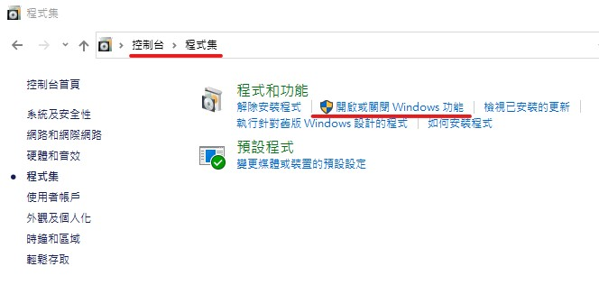
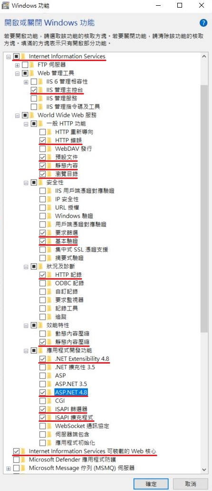
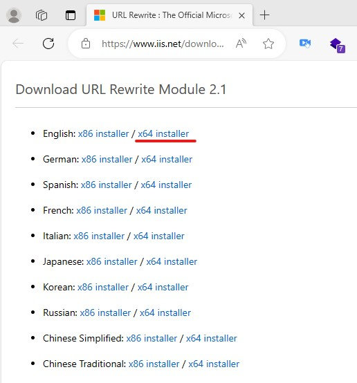
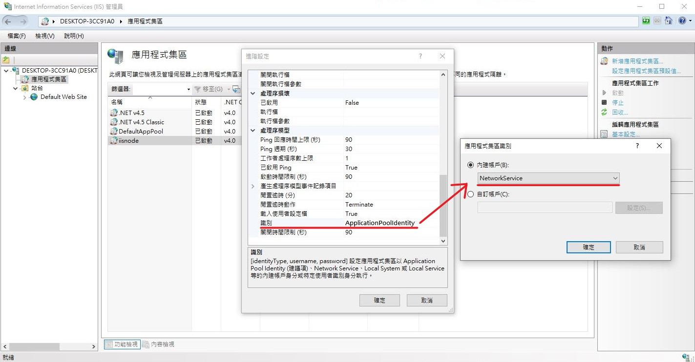
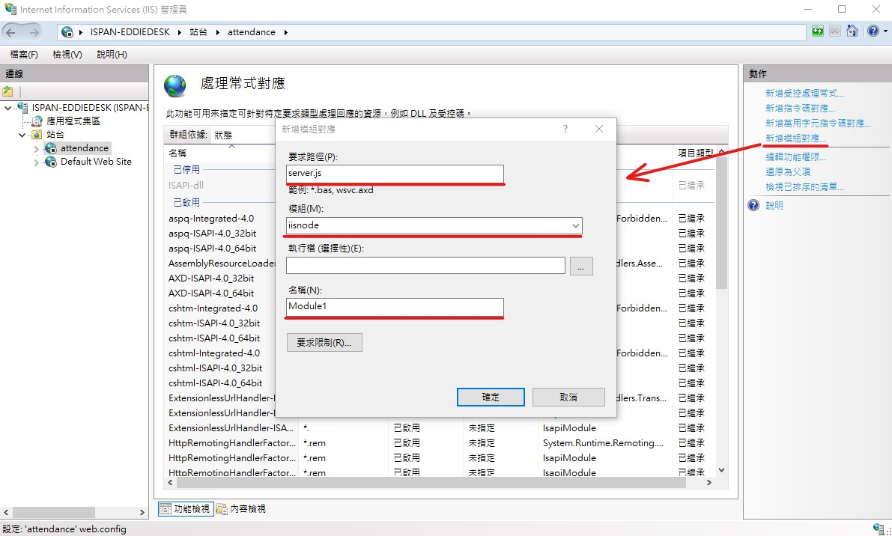

## 前端工程師負責部分
### 專案打包指令
1. 在終端機中輸入「 npm run build 」，會在資料夾中產出「 .next/ 」資料夾。
2. 將「 .next/ 」、「 node_modules/ 」、「 public/ 」、「 .env 」、「 next.config.js 」、「 package.json 」、「 package-lock.json 」放入伺服器中的專案資料夾。

> 備註：
 
> 上圖的藍色方框 「 node_modules/ 」和 「 package.json && package-lock.json 」+ npm install 兩種方式可以二擇一。

## 後端工程師負責部分
### 安裝IIS步驟

1. 確認電腦為 windows 專業版
2. 【 控制台 】->【 程式集 】->【 程式和功能 】->【 開啟或關閉windows功能】

3. 把以下圖片IIS相關功能打開(請注意【要求篩選】、【.NET Extensibility 4.8】、【ASP.NET4.8】要另外打開)

4. 安裝【IISnode】(連結：https://github.com/Azure/iisnode/wiki/iisnode-releases)
  請安裝【iisnode for iis 7/8 (x64)】

  一路嚕到底 

5. 安裝【url-rewrite】 (連結：https://www.iis.net/downloads/microsoft/url-rewrite)
  請安裝【English: x64 installer】

  一路嚕到底 

6. 安裝【node.js】(連結：https://nodejs.org/en)

  一路嚕到底 

7. 將專案放置 C:\inetpub

8. 開啟IIS管理員

9. 新增應用程式集區

 命名為【iisnode】 

10. 設定【iisnode】>> 右鍵 >> 進階設定 >> (下拉)識別 >> 應用程式集區識別 >> 內鍵帳戶 >> 選【NetworkService】

11. 新增網站

於應用程式集區 >> 選取 >> 選擇 iisnode
 

 
實體路徑請指向你的NEXT.js的專案
 

 
請把預設的網站停用(以避免80port被占用)，順便把我們新增的網站啟用
 

 
確認是否正確安裝iisnode >> 選到我們的網站 >> 模組
 

點進去後，有看到iisnode，即正確安裝

 
回到設定介面 >> 【處理常識對應】 >> 
 

 
右邊新增模組對應 
 

 
要求路徑：server.js 
模組：iiinode 
名稱：Module1 

 

點選 URL Rewrite

 

新增規則

 

空白規則 

 

名稱：myapp 
模式：/* 
重寫URL：server.js 

 